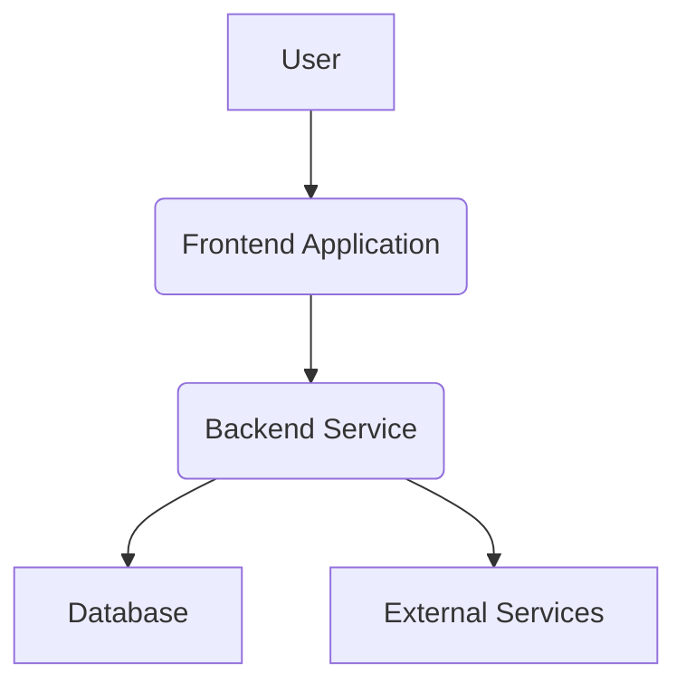
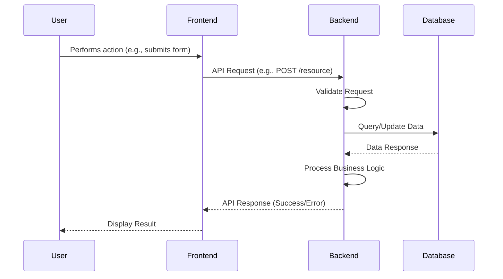

# AI-Project Architecture Document

## Introduction

This document outlines the overall project architecture for AI-Project, including backend systems, shared services, and non-UI specific concerns. Its primary goal is to serve as the guiding architectural blueprint for AI-driven development, ensuring consistency and adherence to chosen patterns and technologies.

**Relationship to Frontend Architecture:**
If the project includes a significant user interface, a separate Frontend Architecture Document will detail the frontend-specific design and MUST be used in conjunction with this document. Core technology stack choices documented herein (see "Tech Stack") are definitive for the entire project, including any frontend components.

### Starter Template or Existing Project

N/A

### Change Log

| Date | Version | Description | Author |
|---|---|---|---|

## High Level Architecture

### Technical Summary

This system's overall architecture style is a modular backend service. It consists of key components interacting through well-defined interfaces. Primary technology choices will be modern and scalable, supporting the project's goals as outlined in the Product Requirements Document (PRD).

### High Level Overview

1.  **Architectural Style:** Modular Backend Service (can evolve into microservices if needed)
2.  **Repository Structure:** Polyrepo (separate repositories for different services/components)
3.  **Service Architecture:** Monolith (initially, with clear boundaries for future microservice extraction)
4.  **Primary User Interaction Flow:** User interacts with a frontend application, which communicates with the backend service via REST APIs. The backend processes requests, interacts with the database, and returns responses.
5.  **Key Architectural Decisions:**
    *   Clear separation of concerns between frontend and backend.
    *   API-first approach for backend development.
    *   Emphasis on scalability and maintainability.

### High Level Project Diagram



### Architectural and Design Patterns

-   **Layered Architecture:** Separating concerns into presentation, business logic, and data access layers. - _Rationale:_ Promotes modularity, testability, and maintainability.
-   **Repository Pattern:** Abstracting data access logic. - _Rationale:_ Enables testing and future database migration flexibility.
-   **API Gateway Pattern:** (If applicable for future microservices) - _Rationale:_ Provides a single entry point for clients, handles routing, authentication, and rate limiting.

## Tech Stack

This section defines the definitive technology selection. These choices would typically be made with explicit user approval.

### Cloud Infrastructure

-   **Provider:** AWS
-   **Key Services:** EC2, RDS, S3, Lambda, API Gateway
-   **Deployment Regions:** us-east-1

### Technology Stack Table

| Category | Technology | Version | Purpose | Rationale |
|---|---|---|---|---|
| **Language** | TypeScript | 5.x | Primary development language | Strong typing, excellent tooling, team expertise |
| **Runtime** | Node.js | 20.x | JavaScript runtime | LTS version, stable performance, wide ecosystem |
| **Framework** | NestJS | 10.x | Backend framework | Enterprise-ready, good DI, matches team patterns |
| **Database** | PostgreSQL | 15.x | Relational Database | Robust, open-source, widely supported |
| **ORM** | TypeORM | 0.3.x | Object-Relational Mapper | Type-safe database interactions |
| **Package Manager** | npm | 10.x | Package management | Standard for Node.js projects |
| **Containerization** | Docker | latest | Application packaging | Consistent environments, easy deployment |
| **CI/CD** | GitHub Actions | N/A | Continuous Integration/Deployment | Automate build, test, and deploy workflows |

## Data Models

### GenericDataModel

**Purpose:** Represents a fundamental entity within the system.

**Key Attributes:**
- id: UUID - Unique identifier for the entity.
- name: String - Name of the entity.
- createdAt: DateTime - Timestamp of creation.
- updatedAt: DateTime - Timestamp of last update.

**Relationships:**
- (To be defined based on specific project needs)

## Components

### GenericComponent

**Responsibility:** Handles a specific set of business logic or functionality.

**Key Interfaces:**
- REST API endpoints for CRUD operations
- Internal methods for business logic execution

**Dependencies:** Database, other internal components, potentially external services.

**Technology Stack:** Node.js, NestJS, TypeORM

## External APIs

No external APIs are assumed for this initial draft. If external APIs are required, this section will be updated with details on purpose, documentation, authentication, rate limits, and key endpoints.

## Core Workflows



## REST API Spec

```yaml
openapi: 3.0.0
info:
  title: AI-Project Backend API
  version: 1.0.0
  description: API for managing AI-Project resources.
servers:
  - url: http://localhost:3000/api
    description: Development Server
```

## Database Schema

```
-- Example for a 'users' table
CREATE TABLE users (
    id UUID PRIMARY KEY,
    name VARCHAR(255) NOT NULL,
    email VARCHAR(255) UNIQUE NOT NULL,
    password_hash VARCHAR(255) NOT NULL,
    created_at TIMESTAMP WITH TIME ZONE DEFAULT CURRENT_TIMESTAMP,
    updated_at TIMESTAMP WITH TIME ZONE DEFAULT CURRENT_TIMESTAMP
);

-- Example for a 'products' table
CREATE TABLE products (
    id UUID PRIMARY KEY,
    name VARCHAR(255) NOT NULL,
    description TEXT,
    price DECIMAL(10, 2) NOT NULL,
    created_at TIMESTAMP WITH TIME ZONE DEFAULT CURRENT_TIMESTAMP,
    updated_at TIMESTAMP WITH TIME ZONE DEFAULT CURRENT_TIMESTAMP
);
```

## Source Tree

```
project-root/
├── src/
│   ├── main.ts                 # Main application entry point
│   ├── app.module.ts           # Root application module
│   ├── modules/                # Feature modules (e.g., users, products)
│   │   ├── user/
│   │   │   ├── user.controller.ts
│   │   │   ├── user.service.ts
│   │   │   ├── user.module.ts
│   │   │   └── user.entity.ts
│   │   └── product/
│   │       ├── product.controller.ts
│   │       ├── product.service.ts
│   │       ├── product.module.ts
│   │       └── product.entity.ts
│   ├── shared/                 # Shared utilities, DTOs, interfaces
│   │   ├── dtos/
│   │   ├── interfaces/
│   │   └── utils/
│   ├── config/                 # Application configuration
│   └── database/               # Database connection and migrations
├── test/                       # Unit and integration tests
├── .env.example                # Environment variables example
├── package.json                # Project dependencies and scripts
├── tsconfig.json               # TypeScript configuration
└── README.md                   # Project README
```

## Infrastructure and Deployment

### Infrastructure as Code

-   **Tool:** AWS CDK 2.x
-   **Location:** `infrastructure/`
-   **Approach:** Define all cloud resources as code.

### Deployment Strategy

-   **Strategy:** Blue/Green Deployment
-   **CI/CD Platform:** GitHub Actions
-   **Pipeline Configuration:** `.github/workflows/deploy.yml`

### Environments

-   **Development:** Local development environment for engineers.
-   **Staging:** Pre-production environment for testing and QA.
-   **Production:** Live environment for end-users.

### Environment Promotion Flow

```text
Development -> Staging -> Production
```

### Rollback Strategy

-   **Primary Method:** Revert to previous stable deployment via CI/CD pipeline.
-   **Trigger Conditions:** Critical errors, performance degradation, security vulnerabilities.
-   **Recovery Time Objective:** < 15 minutes

## Error Handling Strategy

### General Approach

-   **Error Model:** Centralized error handling middleware/interceptor.
-   **Exception Hierarchy:** Custom exceptions for business logic errors, standard exceptions for system errors.
-   **Error Propagation:** Errors propagate up to the centralized handler, which formats and logs them.

### Logging Standards

-   **Library:** Winston 3.x
-   **Format:** JSON
-   **Levels:** error, warn, info, debug, verbose
-   **Required Context:**
    -   Correlation ID: UUID generated per request
    -   Service Context: Service name, module, function
    -   User Context: User ID (if authenticated)

### Error Handling Patterns

#### External API Errors

-   **Retry Policy:** Exponential backoff with jitter for transient errors.
-   **Circuit Breaker:** Implemented for unreliable external services.
-   **Timeout Configuration:** Strict timeouts for all external calls.
-   **Error Translation:** Map external API errors to internal error codes/messages.

#### Business Logic Errors

-   **Custom Exceptions:** Specific custom exceptions for different business rule violations.
-   **User-Facing Errors:** Generic, user-friendly messages; detailed errors logged internally.
-   **Error Codes:** Standardized error codes for different types of business errors.

#### Data Consistency

-   **Transaction Strategy:** ACID transactions for critical operations.
-   **Compensation Logic:** (If applicable for distributed transactions)
-   **Idempotency:** Ensure idempotent operations where necessary (e.g., payment processing).

## Coding Standards

These standards are MANDATORY for AI agents.

### Core Standards

-   **Languages & Runtimes:** TypeScript 5.x, Node.js 20.x
-   **Style & Linting:** ESLint with Prettier
-   **Test Organization:** Tests co-located with source files (e.g., `user.service.ts`, `user.service.spec.ts`)

### Naming Conventions

| Element | Convention | Example |
|---|---|---|
| **Variables** | camelCase | `userName` |
| **Functions** | camelCase | `getUserById` |
| **Classes** | PascalCase | `UserService` |
| **Files** | kebab-case | `user-service.ts` |

### Critical Rules

-   **Logging:** Never use `console.log` in production code; use the configured logger.
-   **API Responses:** All API responses must use a standardized `ApiResponse` wrapper type.
-   **Database Access:** Database queries must use the repository pattern; never direct ORM calls in controllers/services.

## Test Strategy and Standards

### Testing Philosophy

-   **Approach:** Test-after development, with a strong emphasis on automated testing.
-   **Coverage Goals:** Aim for high unit test coverage (>80%), significant integration test coverage.
-   **Test Pyramid:** Prioritize unit tests, followed by integration tests, and a smaller number of end-to-end tests.

### Test Types and Organization

#### Unit Tests

-   **Framework:** Jest 29.x
-   **File Convention:** `*.spec.ts`
-   **Location:** Co-located with source files.
-   **Mocking Library:** Jest's built-in mocking.
-   **Coverage Requirement:** >80% line, branch, and statement coverage.

    **AI Agent Requirements:**
    -   Generate tests for all public methods.
    -   Cover edge cases and error conditions.
    -   Follow AAA pattern (Arrange, Act, Assert).
    -   Mock all external dependencies.

#### Integration Tests

-   **Scope:** Verify interactions between components and with external systems (e.g., database, external APIs).
-   **Location:** `test/integration/`
-   **Test Infrastructure:**
    -   **Database:** Testcontainers with PostgreSQL for realistic testing.
    -   **Message Queue:** (If applicable) In-memory mock or Testcontainers Kafka.
    -   **External APIs:** Mocked using tools like Nock or WireMock.

#### End-to-End Tests

-   **Framework:** Playwright 1.x
-   **Scope:** Simulate real user scenarios across the entire application stack.
-   **Environment:** Dedicated staging environment.
-   **Test Data:** Seeded test data for consistent test runs.

### Test Data Management

-   **Strategy:** Use factories to generate realistic test data.
-   **Fixtures:** Defined in `test/fixtures/`.
-   **Factories:** Implemented using libraries like `faker.js`.
-   **Cleanup:** Database cleanup after each test suite.

### Continuous Testing

-   **CI Integration:** Unit and integration tests run on every push to `main` and pull request.
-   **Performance Tests:** (Future consideration) Load testing with k6.
-   **Security Tests:** SAST scans on every build, DAST scans on staging deployments.

## Security

### Input Validation

-   **Validation Library:** class-validator
-   **Validation Location:** At the API boundary (controllers/gateways) and before business logic execution.
-   **Required Rules:**
    -   All external inputs MUST be validated.
    -   Validation at API boundary before processing.
    -   Whitelist approach preferred over blacklist.

### Authentication & Authorization

-   **Auth Method:** JWT-based authentication with Passport.js.
-   **Session Management:** Stateless JWTs.
-   **Required Patterns:**
    -   All authenticated endpoints require a valid JWT.
    -   Role-based access control (RBAC) for authorization.

### Secrets Management

-   **Development:** Environment variables (`.env` files).
-   **Production:** AWS Secrets Manager.
-   **Code Requirements:**
    -   NEVER hardcode secrets.
    -   Access via configuration service only.
    -   No secrets in logs or error messages.

### API Security

-   **Rate Limiting:** Implemented using a middleware (e.g., `express-rate-limit`).
-   **CORS Policy:** Configured to allow specific origins.
-   **Security Headers:** Implement standard security headers (e.g., X-Content-Type-Options, X-Frame-Options).
-   **HTTPS Enforcement:** Enforced at the load balancer/API Gateway level.

### Data Protection

-   **Encryption at Rest:** Database encryption (e.g., AWS RDS encryption).
-   **Encryption in Transit:** HTTPS/TLS for all communication.
-   **PII Handling:** Encrypt PII fields in the database; minimize PII logging.
-   **Logging Restrictions:** Do not log sensitive data (passwords, PII, tokens).

### Dependency Security

-   **Scanning Tool:** Snyk or OWASP Dependency-Check.
-   **Update Policy:** Regularly update dependencies; review major version changes.
-   **Approval Process:** New dependencies require security review and approval.

### Security Testing

-   **SAST Tool:** SonarQube or Snyk Code.
-   **DAST Tool:** OWASP ZAP or Burp Suite (on staging).
-   **Penetration Testing:** Annual third-party penetration tests.

## Checklist Results Report

## Next Steps

After completing the architecture:

1.  If project has UI components:
    -   Use "Frontend Architecture Mode"
    -   Provide this document as input

2.  For all projects:
    -   Review with Product Owner
    -   Begin story implementation with Dev agent
    -   Set up infrastructure with DevOps agent

### Architect Prompt

(This section is conditional and would be generated if the project has UI components)
